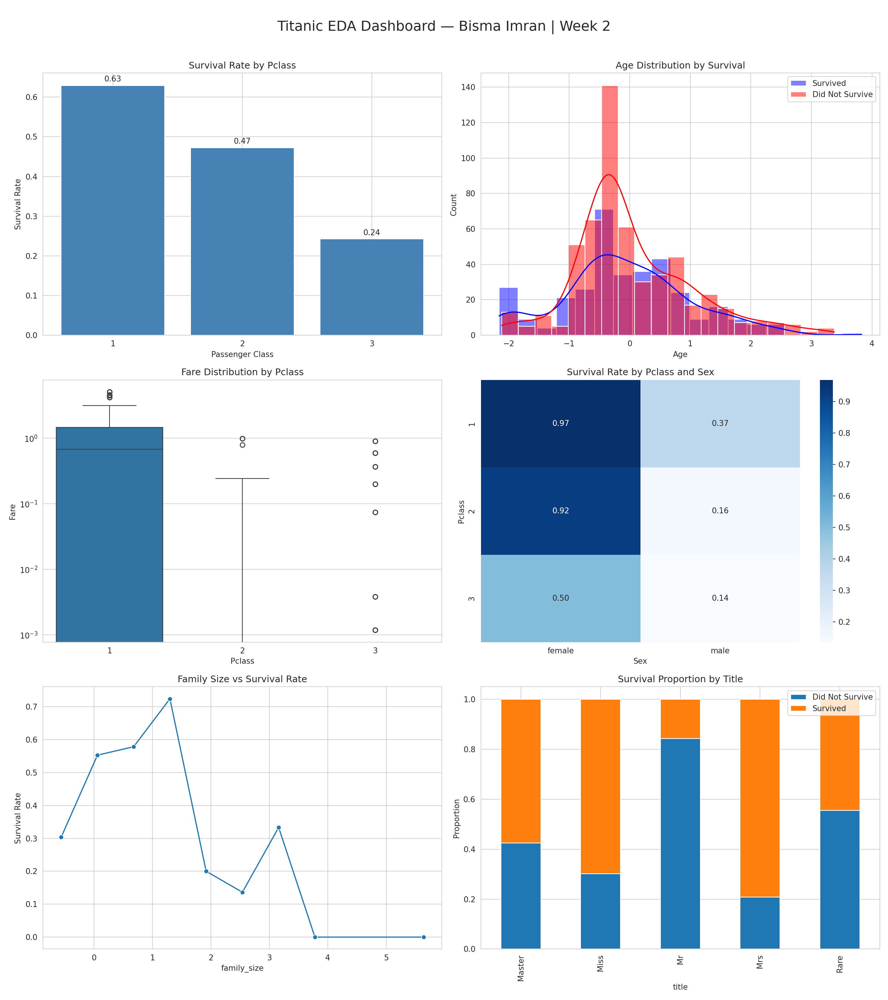

# 🚢 Titanic Survival Analysis — AI/ML Internship Week 2

## 👩‍💻 Author
### **Bisma Imran**
BS Computer Science Student  

---

# 📌 Project Overview

This project focuses on performing complete exploratory data analysis and preprocessing on the Titanic passenger dataset using Python.

The main objective of this project was not only to analyze passenger survival patterns, but also to prepare the dataset professionally for future machine learning tasks. The workflow followed a real-world data analysis pipeline including data inspection, cleaning, handling missing values, outlier treatment, feature engineering, encoding, scaling, statistical analysis, and visualization.

The project was completed as part of the **AI/ML Internship Program — Week 2**, with a strong focus on practical implementation using NumPy and Pandas.

---

# 📂 Dataset Information

The Titanic dataset contains passenger records from the Titanic disaster and includes demographic, social, and travel-related information.

### Dataset Features Included:
- PassengerId
- Survived
- Pclass
- Name
- Sex
- Age
- SibSp
- Parch
- Ticket
- Fare
- Cabin
- Embarked

The dataset was analyzed to understand which factors had the strongest relationship with passenger survival.

---

# 🎯 Project Goals

The main goals of this project were:

- Perform detailed exploratory data analysis
- Handle missing and inconsistent data professionally
- Detect and manage outliers
- Engineer meaningful features from raw data
- Apply encoding and feature scaling
- Build an ML-ready cleaned dataset
- Discover survival patterns using statistical analysis and visualizations
- Prepare strong foundational features for future machine learning models

---

# 🧹 Data Cleaning & Preprocessing

Several preprocessing techniques were applied to improve data quality and prepare the dataset for analysis.

### ✔ Missing Value Handling
- `Age` values filled using grouped median based on passenger class and gender
- `Embarked` values filled using mode
- `Cabin` converted into a binary feature (`has_cabin`) before dropping the original column

### ✔ Data Type Corrections
- Converted categorical features into appropriate category data types
- Fixed column consistency for analysis and ML compatibility

### ✔ Outlier Treatment
- Extreme Fare values capped using the 99th percentile
- Preserved real passenger records instead of removing them

### ✔ Feature Scaling
Applied `StandardScaler` on:
- Age
- Fare
- family_size
- fare_per_person

---

# ⚙️ Feature Engineering

Several new features were created to improve analysis quality and future model performance.

| Engineered Feature | Purpose |
|---|---|
| `family_size` | Total family members traveling together |
| `is_alone` | Identifies passengers traveling alone |
| `fare_per_person` | Better estimate of individual travel cost |
| `title` | Extracted social titles from passenger names |
| `age_group` | Categorized passengers by age |
| `deck` | Extracted deck information from cabin |
| `fare_bin` | Grouped fare ranges into categories |
| `has_cabin` | Indicates whether cabin information exists |

These features helped reveal hidden patterns connected to survival behavior.

---

# 📊 Exploratory Data Analysis

The project included detailed statistical analysis and visual exploration of survival trends.

### Areas Explored:
- Survival rate by passenger class
- Survival comparison by gender
- Age distribution of survivors vs non-survivors
- Fare distribution across classes
- Family size impact on survival
- Correlation analysis between numerical features
- Survival heatmaps and pivot table analysis

---

# 🔍 Top Survival Insights

## 1️⃣ Gender Was the Strongest Survival Factor
Female passengers survived at significantly higher rates than male passengers across almost every passenger class.

---

## 2️⃣ Passenger Class Strongly Influenced Survival
First-class passengers had much higher survival rates compared to third-class passengers, showing the impact of social and economic status during evacuation.

---

## 3️⃣ Higher Fare Passengers Had Better Survival Chances
Passengers paying higher fares generally had better access to safer locations and lifeboats, leading to improved survival outcomes.

---

# 📈 Dashboard Preview

## Titanic EDA Dashboard



The dashboard includes:
- Survival rate analysis
- Age distributions
- Fare distribution comparisons
- Heatmaps
- Family survival trends
- Title-based survival proportions

---

# 📉 Correlation & ML Preparation

A complete correlation analysis was performed on the final ML-ready dataset to identify:
- strongest predictors of survival
- multicollinearity between features
- weak features for possible removal

### Most Important ML Features:
- sex_encoded
- Pclass
- Fare
- family_size
- is_alone
- age_group_encoded
- fare_per_person

The final cleaned dataset was exported as:
```text
titanic_cleaned.csv
